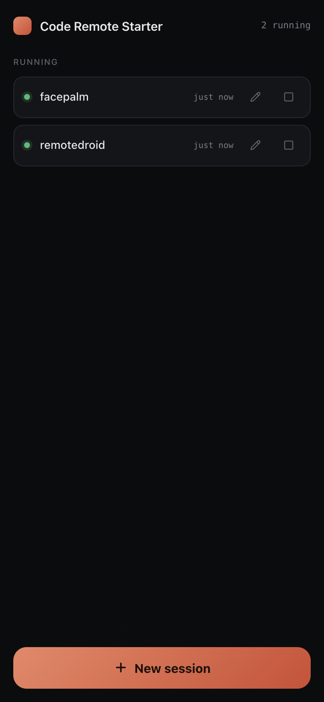
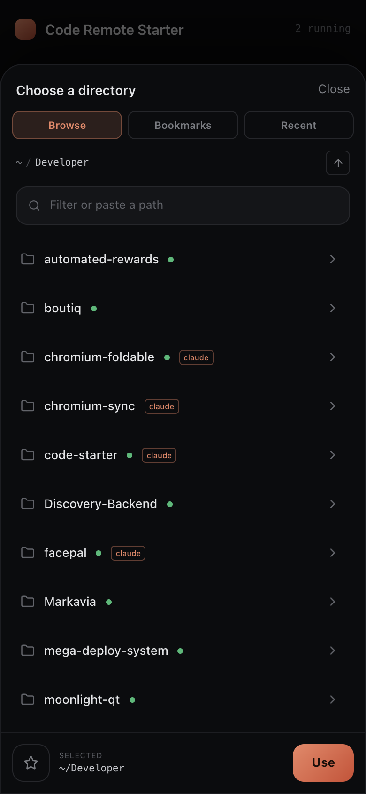
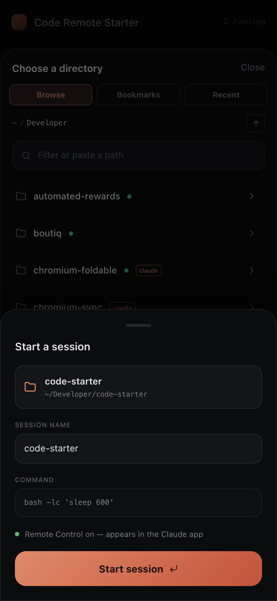

# Code Remote Starter

Start Claude Code sessions in any directory on your Mac — from your phone.

The Claude mobile app's Remote Control can drive sessions that already exist, but it can't
**start a new session in a new directory**. For that you still have to walk to your Mac, open a
terminal, `cd`, and run Claude Code. Code Remote Starter closes that gap: a small web app that
runs on your Mac and is reachable from your phone. Pick a directory, confirm, and it launches a
session there with Remote Control on — so it shows up in the Claude app and you drive it from
your phone as usual.

<p align="center">
  
  
  
</p>

## How it works

When you launch a session, the server runs your Claude Code command inside a **detached `tmux`
session** in the directory you chose:

```
claude --dangerously-skip-permissions --effort max --remote-control "<session name>"
```

`tmux` gives Claude Code the terminal it needs while keeping the process alive independently of
the browser. Because Remote Control is enabled, the session registers with Anthropic and appears
in the Claude mobile app, where you do the actual work. Code Remote Starter is purely the
launcher and session manager — it never proxies your conversation.

The base command is configurable; it defaults to the equivalent of the common `cym` alias
(`claude --dangerously-skip-permissions --effort max`).

## Requirements

- macOS
- [`tmux`](https://github.com/tmux/tmux) — `brew install tmux`
- Claude Code on your `PATH`, signed in, with Remote Control enabled at startup
  (`"remoteControlAtStartup": true` in `~/.claude/settings.json`)
- Node.js 20+

## Quick start

```bash
git clone https://github.com/burakgon/code-remote-starter.git
cd code-remote-starter
npm install
npm run build
npm start
```

Run it from a shell where `claude` already works, so the launched sessions inherit your
sign-in. On start it prints an access URL for this Mac, plus a LAN URL and a **QR code** for
your phone:

```
  Code Remote Starter is listening on 0.0.0.0:4317

  On this Mac:
    http://localhost:4317/?token=…

  On your phone (same Wi-Fi / Tailscale) — scan the QR or open the URL:
    http://192.168.1.20:4317/?token=…
    █▀▀▀▀▀█ ▀▌▄█ █▀▀▀▀▀█
    …
```

Scan the QR with your phone's camera (on the same network) — it opens the full URL, so the long
token can't get truncated in transit.

For day-to-day development with hot reload:

```bash
npm run dev      # Vite on :5173 proxying the API to the server on :4317
```

## Reaching it from your phone

The server binds to `0.0.0.0` so it is reachable on your network, and the access token is what
protects it. The easiest way in is to **scan the QR code** printed at startup. Otherwise:

- **Same Wi‑Fi:** open `http://<your-mac-ip>:4317/?token=…` on your phone.
- **Anywhere:** put your Mac and phone on a private network such as
  [Tailscale](https://tailscale.com) and use the Mac's Tailscale address.

Code Remote Starter launches Claude Code with `--dangerously-skip-permissions`, so treat the URL
like a password and only expose it over networks you trust. A first-class tunnel is on the
roadmap.

## Security

- Every HTTP request and the WebSocket require a valid token. The token is generated on first
  run and stored in `~/.config/code-remote-starter/config.json` (mode `0600`).
- The token arrives once via `?token=…`, then is kept in a `Strict`, `httpOnly` cookie; the URL
  is tidied so the token isn't left in the address bar.
- State-changing requests are checked against an `Origin` allowlist (CSRF guard).
- Brute-force protection: more than 5 wrong-token attempts from an IP within an hour locks
  that IP for 30 minutes. Behind a Cloudflare tunnel the real client IP (`CF-Connecting-IP`)
  is used, so the lock targets the actual attacker rather than the tunnel's loopback address.
- Nothing leaves your machine except Claude Code's own traffic.

## Configuration

`~/.config/code-remote-starter/config.json`:

| Key           | Default                                              | Description                  |
| ------------- | ---------------------------------------------------- | ---------------------------- |
| `port`        | `4317`                                               | Port to listen on.           |
| `host`        | `0.0.0.0`                                            | Interface to bind.           |
| `baseCommand` | `claude --dangerously-skip-permissions --effort max` | Command run in each session. |
| `token`       | generated                                            | Access token.                |

Command-line flags override the config for a run: `--port`, `--host`, `--command`, `--open`.

```bash
npm start -- --port 8080 --command "claude --effort max"
```

Set `CRS_CONFIG_DIR` to relocate the config directory.

## Features

- Touch-first directory picker: browse the filesystem, paste a path, with Git and
  "used with Claude before" indicators.
- Bookmark directories you launch into often.
- Recent directories, drawn from your launch history and from where you've used Claude Code.
- Live session list over a WebSocket — rename or stop sessions.
- One dark, considered interface that works on phone, foldable, and desktop.

## Development

```bash
npm run dev         # server + web with hot reload
npm test            # unit + integration tests (Vitest)
npm run typecheck   # tsc --noEmit
npm run lint        # ESLint
npm run build       # build web (and server bundle) into dist/
```

The backend lives in `src/server` (Hono + `ws`, sessions via `tmux`); the web app in `src/web`
(React + Vite + Tailwind). Design and implementation notes are under `docs/superpowers/`.

## Roadmap

- Optional "working vs needs input" session status via a Claude Code hook.
- A built-in tunnel for zero-config remote access.
- Light theme.

## License

MIT
